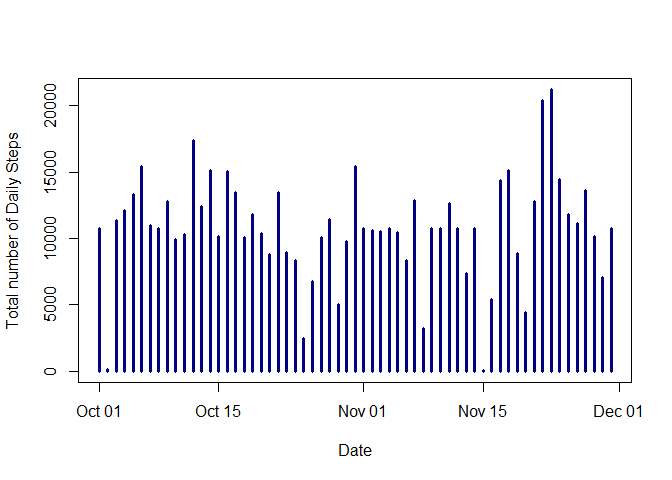

## Loading and preprocessing the data

```r
activity <- read.csv("activity.csv", header = TRUE, sep = ",")
```

```r
library(lubridate)
```

```
## 
## Attaching package: 'lubridate'
```

```
## The following object is masked from 'package:base':
## 
##     date
```


```r
activity$date <- ymd(activity$date)
```

 And now we can create another version of the dataset where all NA values are removed

```r
activity_rm_NA <- na.omit(activity)
```


## What is mean total number of steps taken per day?

```r
library(dplyr)
```

```
## 
## Attaching package: 'dplyr'
```

```
## The following objects are masked from 'package:lubridate':
## 
##     intersect, setdiff, union
```

```
## The following objects are masked from 'package:stats':
## 
##     filter, lag
```

```
## The following objects are masked from 'package:base':
## 
##     intersect, setdiff, setequal, union
```


```r
 num_daily_steps <- summarise(group_by(activity_rm_NA, date), sum_steps = sum(steps))
View(num_daily_steps)
```


```r
plot(num_daily_steps, type = "h", col = "navy blue", lwd = 3, xlab = "Date", ylab = "Total number of Daily Steps" )
```

<!-- -->


```r
mean_activity <- mean(num_daily_steps$sum_steps)
print(mean_activity)
```

```
## [1] 10766.19
```

```r
median_activity <- median(num_daily_steps$sum_steps)
print(median_activity)
```

```
## [1] 10765
```


## What is the average daily activity pattern?
in order to make a plot of the 5-minute interval and the average number of steps taken in each

```r
  steps_per_interval <- summarise(group_by(activity_rm_NA, interval), mean_interval = mean(steps))
  plot(steps_per_interval, type = "l", xlab = "5-minute Intervals", ylab ="Average number of steps", lwd = 3, col = "red")
```

<!-- -->


```r
steps_per_interval[which.max(steps_per_interval$mean_interval),]
```

```
## # A tibble: 1 x 2
##   interval mean_interval
##      <int>         <dbl>
## 1      835           206
```


## Imputing missing values

```r
sum(is.na(activity))
```

```
## [1] 2304
```

and now we will create a new dataset (activity2) with missing data (NA's) replaced with its respective 5-minute interval mean from table (steps_per_interval)

```r
activity2 <- activity
activity2$steps[is.na(activity2$steps)] <- steps_per_interval$mean_interval
```

To plot the total number of daily steps after replacing the NA values, we first create and new dataset (num_daily_steps2) with the sum of daily steps from (activity2)

```r
num_daily_steps2 <- summarise(group_by(activity2, date), sum_steps2 = sum(steps))
```

Then we can plot the results

```r
plot(num_daily_steps2, type = "h", col = "navy blue", lwd = 3, xlab = "Date", ylab = "Total number of Daily Steps" )
```

<!-- -->

And then let's calculate the mean and the median of new dataset (num_daily_steps2)

```r
mean(num_daily_steps2$sum_steps2)
```

```
## [1] 10766.19
```

```r
mean(num_daily_steps$sum_steps)
```

```
## [1] 10766.19
```

```r
median(num_daily_steps2$sum_steps2)
```

```
## [1] 10766.19
```

```r
median(num_daily_steps$sum_steps)
```

```
## [1] 10765
```
 From the results above we can see that imputing the missing data didn't have effect on the estimates of the total daily number of steps.


## Are there differences in activity patterns between weekdays and weekends?
To create a new factor variable that distinguishes weekdays from weekends

```r
activity <- mutate(activity, day_of_week = weekdays(activity$date))
```

And now to make a panel plot of the 5-minute interval and the average number of steps on both weekdays and weekends, we first create 2 datasets for (weekdays and weekends), and calculate the average number of steps by interval in each:

```r
activity_weekend <- filter(activity, day_of_week == c("Saturday", "Sunday"))

weekend_perinterval <- summarise(group_by(na.omit(activity_weekend), interval), mean_interval = mean(steps))


activity_weekday <- filter(activity, day_of_week %in% c("Monday", "Tuesday", "Wednesday", "Thursday", "Friday"))

weekday_perinterval <- summarise(group_by(na.omit(activity_weekday), interval), mean_interval = mean(steps))
```

And then we can create the plot

```r
par(mfrow = c(2,1), mar = c(1, 1, 1, 1), cex.main = 1)
plot(weekend_perinterval, type = "l", main = "Average n steps on Weekends", col = "darkblue")
plot(weekday_perinterval, type = "l", main = "Average n steps on Weekdays", col = "darkblue")
```

<!-- -->
